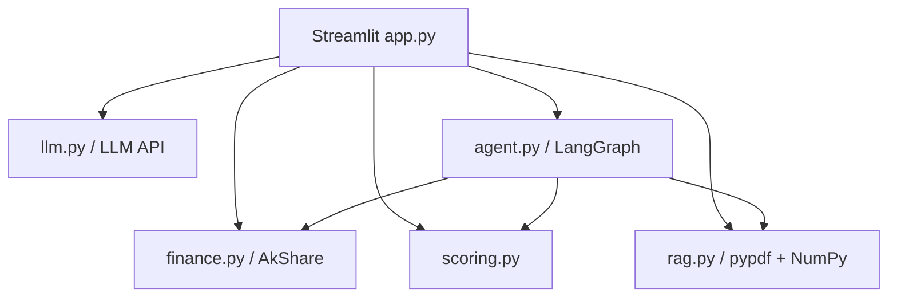
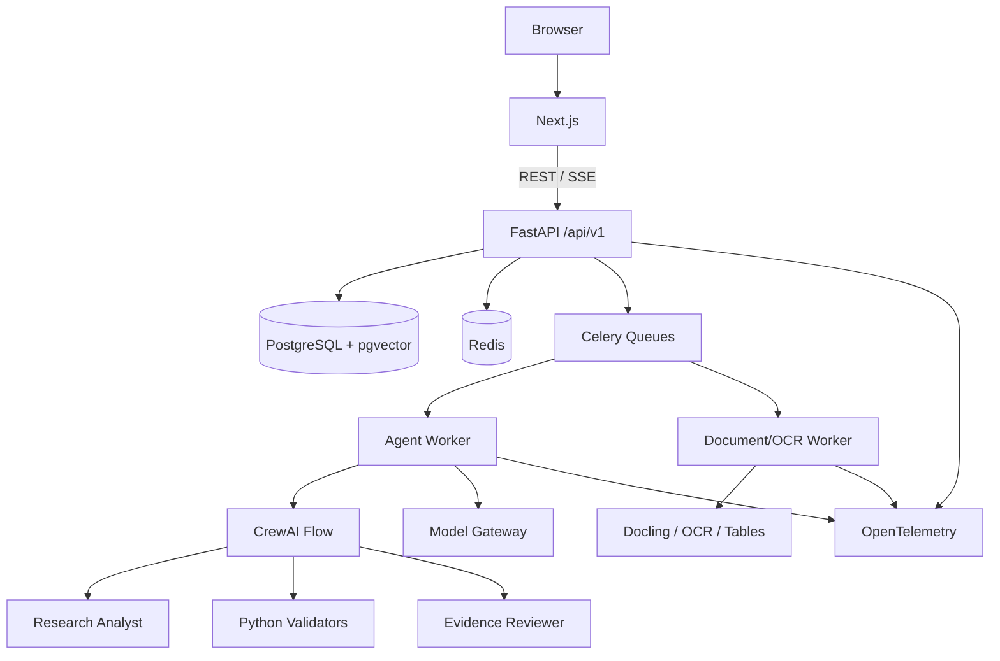

# AI 投研 Agent 四阶段升级路线

> **执行 Agent：** 使用 `superpowers:executing-plans`，每次只执行一个 `P*-*` 工作包。开始编码前，为当前工作包生成逐文件实施计划；不得一次执行整个路线图。

**日期：** 2026-08-05

**目标：** 在保留现有 Streamlit Demo 回归能力的前提下，逐步升级为 Next.js + FastAPI、多用户、SSE、CrewAI、RAG/OCR/表格、安全、监控、Docker 和 CI/CD 完整的工程化投研 Agent。

**主架构：** 模块化单体 + 独立 Worker；Next.js 负责交互，FastAPI 是唯一业务入口，PostgreSQL 是业务事实来源，Redis 只负责队列/限流/缓存，CrewAI Flow 控制双 Agent 流程。
**默认技术：** Python 3.12、FastAPI、Pydantic v2、SQLAlchemy 2、Alembic、Next.js + TypeScript、PostgreSQL + pgvector、Redis、Celery、CrewAI Flow、Docling、OpenTelemetry、Docker Compose、GitHub Actions。

---

## 1. 怎么使用这份路线图

### 1.1 执行循环

```text
选择当前工作包
  → 检查依赖和阶段门禁
  → 生成当前工作包的逐文件计划
  → 建立短分支
  → 写失败测试并确认失败原因
  → 做最小实现
  → 运行定向测试和阶段回归
  → 更新文档
  → 检查 diff、Secret 和无关文件
  → 提交一个可独立回滚的 commit
  → 回填实际证据
```

### 1.2 全局约束

- 保留 `app.py`、`agent.py`、`rag.py`、`llm.py`、`finance.py`、`scoring.py`；五项功能完成等价迁移前不得删除 Streamlit。
- Next.js 是唯一目标前端，迁移期不再给 Streamlit 增加新业务功能。
- API 固定使用 `/api/v1`；流式输出使用 SSE，当前不引入 WebSocket。
- PostgreSQL 保存不可丢失的业务状态；Redis 丢失后系统仍应能恢复。
- CrewAI 只启用“研究分析师 Agent + 证据审核员 Agent”；分析师、审核员、管理员仍是人类 RBAC 角色。
- 自主 Agent 不得拥有管理员权限、任意 Shell/Python、发布、删除、用户管理或权限修改工具。
- 普通文本、选择性 OCR 和表格解析进入同一文档管线；表格必须保留无损单元格结构。
- 默认使用云端模型 API 和 CPU；GPU、本地模型、LoRA 和 Kubernetes 必须由第四阶段指标触发。
- 日志默认不记录原始 Prompt、文档正文、API Key、身份证、手机号、邮箱等敏感内容。
- 每次只完成一个小功能，测试、文档、验收和回滚与代码一起提交。
- Mock 压测不得描述成真实模型 QPS；未执行的测试不得描述为已通过。
- 遇到不相关用户改动，只记录，不修改、不暂存、不提交。

### 1.3 六项工作包格式

每个工作包只保留六项：

1. 目标与优先级。
2. 范围与明确不做。
3. 文件与核心接口。
4. 实施步骤、依赖和环境变量。
5. 测试与验收。
6. 依赖、风险与回滚。

认证、数据库迁移、GPU、LoRA 等高风险任务把额外硬门合并到第 5 项，不重复扩展成 14 个标题。

---

## 2. 当前项目基线

### 2.1 当前架构

当前项目是单进程、扁平目录的 Streamlit 应用：



已实现能力：行情和技术指标、财报/新闻摘要、PDF 内存 RAG、五维结构化评分、LangGraph 工具调用、OpenAI 兼容模型配置。

### 2.2 最重要的问题

| 问题 | 影响 |
|---|---|
| `agent.py` 使用全局 `_CURRENT_STORE` | 多用户可能串用知识库 |
| 缺失指标自动重算权重 | 单个高分指标也能产生 A 级结论 |
| Agent 无步数/预算/持久化/取消 | 费用、超时和恢复不可控 |
| `agent.py` 硬编码模型名 | 模型配置行为不一致 |
| RAG 仅内存、无页码/ACL/OCR/表格 | 无法处理真实金融文档 |
| 外部数据异常可能被跳过 | 不完整数据不易被发现 |
| 无测试、锁文件、Docker、CI/CD | 无稳定迭代和发布路径 |
| 无认证、脱敏、注入与 Tool Policy | 无法安全开放给多人 |
| 无日志、Trace、Token/成本指标 | 出错和超支后难以定位 |

最优先五项：评分质量门、FastAPI/Next.js 边界、测试与 Docker、持久化 Run/Document/Workspace、可引用且隔离的 RAG。

当前明确不做：微服务拆分、Kafka、数据库分片、无限多 Agent、任意代码工具、GPU、本地大模型和 LoRA。

---

## 3. 目标架构与目录



推荐目录：

```text
投研agent/
├── frontend/                  # Next.js
│   ├── app/
│   ├── components/
│   ├── lib/api/
│   ├── lib/sse/
│   └── tests/
├── backend/
│   ├── app/
│   │   ├── api/v1/
│   │   ├── core/
│   │   ├── db/
│   │   ├── domain/
│   │   ├── agents/
│   │   ├── tools/
│   │   ├── ingestion/
│   │   ├── models/
│   │   ├── security/
│   │   ├── observability/
│   │   └── workers/
│   ├── alembic/
│   └── tests/
├── evals/                    # Agent/Prompt/RAG/安全评测集
├── deploy/                   # Compose、OTel、监控和 GPU overlay
├── docs/                     # 架构、API、开发、运维、Runbook、ADR
├── loadtests/
├── .github/workflows/
├── pyproject.toml
├── uv.lock
├── app.py                    # 迁移期回归入口
├── agent.py
├── finance.py
├── scoring.py
├── rag.py
└── llm.py
```

---

## 4. 总优先级与技术选型

| 能力 | 何时做 | 工作包 |
|---|---|---|
| 评分覆盖率门禁、测试、依赖锁 | 立即 | P1-01 |
| FastAPI、Next.js、PostgreSQL、Docker、基础 CI | 当前必做 | P1-02—P1-06 |
| SSE、模型网关、Tool Registry、CrewAI | 工程底座后 | P2-01—P2-04 |
| Docling、OCR、表格、pgvector RAG、评测 | Agent 基础后 | P2-05—P2-07 |
| OIDC/RBAC/RLS、安全、Celery、限流、监控、CD | 多人生产前 | P3-01—P3-06 |
| 多实例/PgBouncer | 压测或连接压力出现 | P3-04 |
| 更多 Agent | 固定评测证明收益 | P4-01 |
| GPU/本地模型 | 队列、隐私或成本触发 | P4-02 |
| Fine-tuning/LoRA | 有稳定评测和人工批准数据 | P4-03 |
| Kubernetes/服务拆分 | SLA、容量和团队能力触发 | P4-04 |

关键选型：

| 领域 | 推荐 | 当前不选 |
|---|---|---|
| 前端 | Next.js App Router + TypeScript | Streamlit 最终产品 |
| API | FastAPI REST + SSE | GraphQL、当前 WebSocket |
| Agent | CrewAI Flow + 双 Agent + Python 硬门 | 自由自治多 Agent、管理员 Agent |
| 状态 | PostgreSQL Run/Event | 全局 Memory、Redis 业务真相 |
| 长任务 | Celery + Redis | FastAPI BackgroundTasks 执行 Agent/OCR |
| 文档 | Docling + 选择性 OCR | 仅 pypdf、全页无差别 OCR |
| RAG | pgvector + FTS + RRF + Rerank | 立即独立向量数据库 |
| 模型 | 云 API + Model Gateway | 当前本地全量部署 |
| 部署 | Docker Compose | 当前 Kubernetes |
| Git | main + 短分支 + squash | 长期 develop |

---

# 阶段一：基础工程化

## 5. 阶段目标与门禁

让项目结构清晰、可运行、可测试、可部署。阶段一不加入 CrewAI、OCR、完整 RAG、GPU 或 LoRA。

- [ ] Python 3.12、Node 版本和 Python/Node 锁文件固定。
- [ ] Streamlit 旧入口仍可运行。
- [ ] FastAPI 提供健康、版本和评分 API。
- [ ] Next.js 完成评分垂直切片。
- [ ] 单个指标不能产生 A—E 总体评级。
- [ ] PostgreSQL、API、前端可用 Compose 启动。
- [ ] PR 自动检查后端、前端和镜像。
- [ ] README 能指导从零启动。

## P1-01 工程基线与评分数据质量门

### 1. 目标与优先级

**P0，第一个立即执行的任务。** 保留现有评分插值算法，增加数据质量门：总权重覆盖率至少 80%，且估值、盈利、成长、财务健康四个核心维度各至少一个有效指标，才允许输出 A—E；否则返回 `insufficient_data`。

### 2. 范围与明确不做

范围：`scoring.py`、测试、Python 工具配置、锁文件和 README。

不做：UI、FastAPI、LLM、AkShare、RAG、模块搬迁或插值算法重写。

### 3. 文件与核心接口

- Modify: `scoring.py`、`.gitignore`、`README.md`
- Create: `pyproject.toml`、`.python-version`、`uv.lock`
- Create: `tests/unit/test_scoring_quality.py`

```python
from typing import Any, Literal, TypedDict

class ScoreEvaluation(TypedDict):
    status: Literal["ok", "insufficient_data"]
    coverage: float
    missing_core_dimensions: list[str]
    missing_metrics: list[str]
    result: dict[str, Any] | None

def evaluate_score(metrics: dict[str, Any]) -> ScoreEvaluation:
    """只有覆盖率和核心维度合格时才暴露总体评级。"""
```

### 4. 实施步骤、依赖和环境变量

- [ ] 运行旧实现，记录 `score_stock({"pe_ttm": 10})` 的实际错误语义。
- [ ] 写失败测试：单指标、单核心维度、空输入、非法数值均不得产生评级。
- [ ] 写完整 Demo 指标 Characterization Test，锁住已有维度分数。
- [ ] 实现有限数值检查、加权覆盖率、核心维度检查和缺失项输出。
- [ ] 保留 `score_stock()` 兼容接口；调用者可逐步迁移到 `evaluate_score()`。
- [ ] 使用 `uv`、pytest、pytest-cov、ruff、mypy；无新增运行时依赖和环境变量。
- [ ] 更新 README 的评分语义和离线测试命令。

测试必须至少包含：

```python
def test_single_metric_cannot_produce_rating() -> None:
    output = evaluate_score({"pe_ttm": 10})
    assert output["status"] == "insufficient_data"
    assert output["result"] is None
    assert "profit" in output["missing_core_dimensions"]

def test_complete_metrics_can_produce_rating() -> None:
    output = evaluate_score(COMPLETE_METRICS)
    assert output["status"] == "ok"
    assert output["coverage"] == 1.0
    assert output["result"] is not None
```

### 5. 测试与验收

```bash
uv sync --all-groups
uv run pytest tests/unit/test_scoring_quality.py -q
uv run ruff check scoring.py tests/unit/test_scoring_quality.py
uv run mypy scoring.py
python3 scoring.py
git diff --check
git status --short
```

验收：单指标和单核心维度返回 `insufficient_data`；完整 Demo 结果在定义容差内保持一致；`None`、字符串、NaN、无穷值不计入覆盖率；测试全程离线；diff 不含 `.env`、Secret 和无关文件。

### 6. 依赖、风险与回滚

无前置工作包。风险是旧 UI/Agent 直接读取 `grade`，因此本任务只新增接口、不立即删除旧接口。回滚该工作包的独立 commit 即可恢复旧行为；失败样例必须保留在设计记录中。

## P1-02 FastAPI 评分垂直切片

### 1. 目标与优先级

**P0。** 建立 FastAPI 应用工厂、`/api/v1` Router、Pydantic Schema、统一错误响应和评分 API；首个接口只接收 metrics，不联网取数。

### 2. 范围与明确不做

范围：health、OpenAPI、评分路由、配置和 API 测试。

不做：GraphQL、WebSocket、认证、数据库业务表、AkShare 和模型调用。

### 3. 文件与核心接口

- Create: `backend/app/main.py`、`backend/app/api/router.py`、`backend/app/api/v1/scoring.py`
- Create: `backend/app/core/config.py`、`backend/app/core/errors.py`
- Create: `backend/app/domain/scoring/schemas.py`、`service.py`
- Create: `backend/tests/api/test_health.py`、`test_scoring.py`

```text
GET  /api/v1/health/live
POST /api/v1/scoring/evaluate
GET  /docs
GET  /openapi.json
```

### 4. 实施步骤、依赖和环境变量

- [ ] 依赖 P1-01，通过适配器复用根 `scoring.py`，不复制规则。
- [ ] 安装 FastAPI、Uvicorn、Pydantic Settings、HTTPX、pytest-asyncio。
- [ ] 配置 `APP_ENV`、`API_V1_PREFIX=/api/v1`、`CORS_ORIGINS=http://localhost:3000`。
- [ ] 路由只做协议转换，领域 Service 返回稳定 Schema。
- [ ] 统一 4xx/5xx 响应包含 `error.code` 和 `correlation_id`，生产不返回堆栈。

### 5. 测试与验收

```bash
uv run pytest backend/tests/api/test_health.py backend/tests/api/test_scoring.py -q
uv run uvicorn backend.app.main:app --host 127.0.0.1 --port 8000
curl -fsS http://127.0.0.1:8000/api/v1/health/live
curl -fsS http://127.0.0.1:8000/openapi.json
```

验收：合法请求返回稳定 Schema；非法日期、类型和超大请求返回 4xx；API 测试离线；Swagger 可调用；评分不足不返回 grade/label。

### 6. 依赖、风险与回滚

依赖 P1-01。根模块兼容导入会扩大容器复制范围，阶段二有测试后再迁移。回滚 FastAPI commit 并停止 Uvicorn，Streamlit 不受影响。

## P1-03 Next.js 目标前端

### 1. 目标与优先级

**P0。** 建立 Next.js App Router + TypeScript，完成评分页面、类型化 API Client、错误状态和基础 Layout。

### 2. 范围与明确不做

范围：评分垂直切片和前端工程基线。

不做：一次迁移全部五项功能、在 Next.js 重写 Python 规则、删除 Streamlit。

### 3. 文件与核心接口

- Create: `frontend/app/layout.tsx`、`app/page.tsx`、`app/scoring/page.tsx`
- Create: `frontend/components/scoring-form.tsx`、`score-result.tsx`
- Create: `frontend/lib/api/client.ts`、`types.ts`
- Create: `frontend/tests/scoring-page.test.tsx` 和 Next.js 配置/锁文件

核心接口：`evaluateScore(input, signal?) -> Promise<ScoringResponse>`，返回值用 Zod 校验。

### 4. 实施步骤、依赖和环境变量

- [ ] 依赖 P1-02；使用 Next.js、React、TypeScript、Zod、Vitest、Testing Library。
- [ ] 配置 `NEXT_PUBLIC_API_BASE_URL=http://localhost:8000`，模型 Key 禁止使用 `NEXT_PUBLIC_`。
- [ ] 展示完整评分、数据不足、请求中、超时、4xx 和 5xx 状态。
- [ ] 用 AbortSignal 取消页面请求；生产通过同域反向代理减少 CORS/Cookie 复杂度。

### 5. 测试与验收

```bash
npm --prefix frontend ci
npm --prefix frontend run lint
npm --prefix frontend run typecheck
npm --prefix frontend run test
npm --prefix frontend run build
```

验收：数据不足只显示覆盖率/缺失项；完整数据显示维度明细；错误有重试入口；构建成功；客户端 bundle 不包含模型 Key；Streamlit 仍可对照运行。

### 6. 依赖、风险与回滚

依赖 P1-02。主要风险是跨域和 Cookie，首版使用明确本地域名。停止 `frontend` 或让反向代理回到 Streamlit 即可回滚。

## P1-04 配置、PostgreSQL 与 Alembic

### 1. 目标与优先级

**P0。** 建立统一配置校验、SQLAlchemy 2 异步 Session、PostgreSQL readiness 和 Alembic 迁移基线。

### 2. 范围与明确不做

只创建迁移基础和最小 `app_metadata`；Workspace、Run、Document 表随各自工作包创建。不使用 SQLite 生产路径，不在应用启动时自动执行危险迁移。

### 3. 文件与核心接口

- Create: `backend/app/db/base.py`、`session.py`、`health.py`
- Create: `backend/alembic.ini`、`backend/alembic/env.py`、首个迁移
- Create: `backend/tests/integration/test_database_health.py`
- Modify: `backend/app/core/config.py`、`backend/app/main.py`、`pyproject.toml`

### 4. 实施步骤、依赖和环境变量

- [ ] 安装 SQLAlchemy asyncio、asyncpg、Alembic。
- [ ] 配置 `DATABASE_URL`、`DB_POOL_SIZE=5`、`DB_MAX_OVERFLOW=10`、连接超时。
- [ ] `/health/live` 不依赖数据库；`/health/ready` 检查数据库和迁移版本。
- [ ] 使用 `pool_pre_ping`，每个请求通过依赖注入获得独立 Session。

### 5. 测试与验收

```bash
docker compose -f deploy/compose.base.yml up -d postgres
uv run alembic -c backend/alembic.ini upgrade head
uv run pytest backend/tests/integration/test_database_health.py -q
uv run alembic -c backend/alembic.ini current
```

验收：空库可升级到 head；数据库不可用时 ready=503 但进程仍能诊断；生产缺少 `DATABASE_URL` 时明确失败；连接池规模有文档说明。

### 6. 依赖、风险与回滚

依赖 P1-02。连接池乘以实例数可能超过数据库上限，初始保持小规模。应用回滚优先，数据库采用向前修复；只有无数据写入且 downgrade 明确安全时才手工降级。

## P1-05 Docker Compose 基线

### 1. 目标与优先级

**P0。** 建立可复现的 API、前端、PostgreSQL 和 migrate 容器；区分 base/dev/prod，旧 Streamlit 放入可选 legacy profile。

### 2. 范围与明确不做

使用多阶段、非 root 镜像和健康检查。不把所有服务装进一个容器，不 COPY `.env`，不在阶段一引入 GPU/Docling 重型镜像。

### 3. 文件与核心接口

- Create: `backend/Dockerfile`、`frontend/Dockerfile`
- Create: `deploy/compose.base.yml`、`compose.dev.yml`、`compose.prod.yml`
- Create: `deploy/env/development.example`、`production.example`
- Modify: `.dockerignore`、`README.md`

### 4. 实施步骤、依赖和环境变量

- [ ] 依赖 P1-03/P1-04；锁文件安装依赖，镜像运行用户非 root。
- [ ] PostgreSQL healthy 后运行一次性 migrate；migrate 成功后 API 才启动。
- [ ] 声明数据库和日志持久卷；生产模板只写变量名，不写 Secret。
- [ ] API healthcheck 使用 `/api/v1/health/ready`，前端验证首页响应。

### 5. 测试与验收

```bash
docker compose -f deploy/compose.base.yml -f deploy/compose.dev.yml config
docker compose -f deploy/compose.base.yml -f deploy/compose.dev.yml build
docker compose -f deploy/compose.base.yml -f deploy/compose.dev.yml up -d
curl -fsS http://localhost:8000/api/v1/health/ready
curl -fsS http://localhost:3000
```

验收：空机器只需 Docker 和环境文件；非 root；迁移失败时 API 不 ready；数据库在容器重建后保留；镜像不含 `.env`、`.git`。

### 6. 依赖、风险与回滚

依赖 P1-03/P1-04。文档依赖会膨胀镜像，阶段二必须使用独立 Worker。回滚上一镜像摘要并保留数据库卷；本地仍可直接运行 FastAPI/Streamlit。

## P1-06 Git、基础 CI 与文档

### 1. 目标与优先级

**P0。** 建立个人/小团队可维护的 main + 短分支 + PR + squash 流程，以及后端、前端、镜像基础 CI。

### 2. 范围与明确不做

不建立长期 develop，不在普通 PR 运行大规模付费模型评测，不用永久 ignore 掩盖现有错误。

### 3. 文件与核心接口

- Create: `.github/workflows/backend-ci.yml`、`frontend-ci.yml`、`container-ci.yml`
- Create: `.github/pull_request_template.md`
- Create: `docs/development/local-setup.md`、`git-workflow.md`
- Create: `docs/architecture/overview.md`、`docs/api/overview.md`
- Modify: `README.md`、`.gitignore`

### 4. 实施步骤、依赖和环境变量

- [ ] 分支示例：`codex/feat/scoring-api`、`codex/fix/sse-reconnect`。
- [ ] Conventional Commits；PR 默认 squash；main 启用 required checks/review。
- [ ] 后端执行 ruff/mypy/pytest；前端执行 lint/type/test/build；镜像执行 build。
- [ ] 离线 CI 用 Mock 禁止真实网络；真实 Key 只存在受保护 GitHub Environment。
- [ ] SemVer Tag `vMAJOR.MINOR.PATCH`；Alembic 管理数据库版本。

### 5. 测试与验收

```bash
uv run ruff check .
uv run mypy backend/app scoring.py
uv run pytest -q
npm --prefix frontend ci
npm --prefix frontend run lint
npm --prefix frontend run typecheck
npm --prefix frontend run test
npm --prefix frontend run build
docker compose -f deploy/compose.base.yml -f deploy/compose.dev.yml config
```

验收：PR 必填测试/风险/回滚；CI 不调用收费模型；README 与实际功能和命令一致；数据库变更必须带迁移。

### 6. 依赖、风险与回滚

依赖 P1-01—P1-05。规则初期可限定新目录和关键根模块，再逐步扩大。工作流故障回滚 YAML，但不得为了临时通过关闭 main 保护。

---

# 阶段二：Agent 能力增强

## 6. 阶段目标与门禁

加入持久化 Run、SSE、模型网关、受控 Tool、CrewAI 双 Agent、Docling/OCR/表格和可引用 RAG。阶段二仍允许单实例开发执行器，生产队列在阶段三完成。

- [ ] Run/Event 持久化，刷新和断线后可恢复。
- [ ] SSE 支持事件 ID、重连、心跳、完成、失败和取消。
- [ ] CrewAI Flow 固定分析师 → Python 校验 → 证据审核员 → 人工审核。
- [ ] LangGraph/CrewAI 有同题基准；稳定后只保留 CrewAI 正式路径。
- [ ] Tool 有 Schema、权限、超时、预算和审计。
- [ ] 文档支持 PDF、DOCX、XLSX、PPTX、Markdown、HTML、CSV 和图片。
- [ ] 扫描页选择性 OCR；表格保留单元格、单位、页码和定位。
- [ ] RAG 先 ACL 后检索，使用关键词 + 向量 + RRF + Rerank。
- [ ] 固定评测覆盖检索、引用、无答案、OCR、表格和权限。

## P2-01 Agent Run、上下文和 SSE

### 1. 目标与优先级

**P0。** 把 Agent 执行变成持久化资源：创建、查询、流式事件、取消、超时和恢复都有稳定 API。

### 2. 范围与明确不做

阶段二使用 `RunExecutor` 接口和仅限开发的进程内实现；不把 FastAPI BackgroundTasks 或内存状态当生产任务队列，不引入 WebSocket。

### 3. 文件与核心接口

- Create: `backend/app/domain/agent_runs/{models,schemas,repository,service,executor}.py`
- Create: `backend/app/api/v1/agent_runs.py` 和 Alembic Run/Event 迁移
- Create: `frontend/lib/sse/agent-events.ts`、`components/agent-run-panel.tsx`
- Test: `backend/tests/api/test_agent_run_sse.py`

```text
POST /api/v1/agent/runs
GET  /api/v1/agent/runs/{run_id}
GET  /api/v1/agent/runs/{run_id}/events
POST /api/v1/agent/runs/{run_id}/cancel
```

事件至少包含 `run.started`、`step.started`、`tool.started/finished`、`text.delta`、`review.required`、`run.completed/failed/cancelled` 和 heartbeat。

### 4. 实施步骤、依赖和环境变量

- [ ] 依赖阶段一；新增 `AgentRun`、`AgentRunEvent`、`ConversationMessage`。
- [ ] POST 在数据库落 Run 后返回 202；事件先写 PostgreSQL 再发送。
- [ ] SSE sequence 作为 `id`，读取 `Last-Event-ID` 续传；前端用 fetch + ReadableStream。
- [ ] 配置 `AGENT_RUN_TIMEOUT_SECONDS=180`、`AGENT_MAX_STEPS=8`、`SSE_HEARTBEAT_SECONDS=15`。
- [ ] 每个 Run 记录 correlation、workspace、创建者、模型、Token 和成本字段。

### 5. 测试与验收

```bash
uv run pytest backend/tests/api/test_agent_run_sse.py -q
npm --prefix frontend run test -- agent-run-panel
```

验收：创建快速返回 202；事件有序；重连不丢不重；刷新恢复；取消幂等；终态不可逆；无权限不可读取。进程内执行器必须显式标记 `development_only`。

### 6. 依赖、风险与回滚

依赖阶段一。主要风险是进程重启丢执行线程，因此生产门禁要求 P3-03。前端开关可隐藏新页面，旧 Streamlit Agent 保留；新增表不删除。

## P2-02 模型网关、Prompt 与上下文预算

### 1. 目标与优先级

**P0。** 消除硬编码模型，统一模型调用、Prompt 版本、能力、超时、重试、Token 和成本。

### 2. 范围与明确不做

先用配置规则路由，不训练路由模型；不无限拼接历史；不把 Prompt 当权限边界；不对权限、参数和内容拒绝自动重试。

### 3. 文件与核心接口

- Create: `backend/app/models/{gateway,openai_compatible,schemas,router,costs}.py`
- Create: `backend/app/prompts/analyst/v1/system.md`、`reviewer/v1/system.md`、`manifest.py`
- Test: `backend/tests/unit/models/`、`backend/tests/unit/prompts/`
- Modify: `llm.py`、`agent.py`、`.env.example`

核心协议：`ModelGateway.complete(request, timeout_seconds) -> ModelResponse`；Usage 包含 provider、model、input/output tokens、估算费用和延迟。

### 4. 实施步骤、依赖和环境变量

- [ ] Prompt manifest 保存 ID、版本、SHA、必需变量、输出 Schema 和评测版本。
- [ ] 上下文按安全规则、用户问题、Run 状态、授权证据、对话摘要组装。
- [ ] 超预算时先裁剪低价值历史和重复证据，不裁剪安全规则与当前请求。
- [ ] 429/连接重置/5xx 最多重试 2 次，指数退避与抖动，等待计入 Run deadline。
- [ ] 配置 `CHAT_MODEL`、`REVIEW_MODEL`、`EMBED_MODEL`、单 Run/每日费用预算。

### 5. 测试与验收

```bash
uv run pytest backend/tests/unit/models backend/tests/unit/prompts -q
uv run pytest backend/tests/agent_eval -m offline -q
```

验收：业务代码无模型硬编码；每次调用记录版本/Token/成本/延迟；超预算停止；Mock 覆盖 429、5xx、超时、usage 缺失和 Schema 失败；联网冒烟必须人工触发并限额。

### 6. 依赖、风险与回滚

依赖 P2-01。不同 OpenAI 兼容服务能力不一致，适配器必须声明 tool/stream/usage capability。临时回滚到 `LegacyModelAdapter`，不得恢复模型硬编码。

## P2-03 Tool Registry 与调用策略

### 1. 目标与优先级

**P0。** 所有 Tool 具备类型化输入/输出、权限、数据分类、只读/写入、幂等性、超时、调用上限和审计。

### 2. 范围与明确不做

第一版只有行情快照、结构化评分、知识检索、表格查询四个只读工具。不提供任意 Shell、Python、网络、文件系统或自主注册工具。

### 3. 文件与核心接口

- Create: `backend/app/tools/{base,registry,policy}.py`
- Create: `market_snapshot.py`、`score_stock.py`、`search_knowledge.py`、`query_table.py`
- Test: `backend/tests/unit/tools/test_registry.py`、`backend/tests/security/test_tool_policy.py`
- Modify: `finance.py`、`scoring.py`、`agent.py`

`ToolDefinition` 必须声明 input/output model、required permissions、最高数据分类、access、idempotent、timeout 和 handler。

### 4. 实施步骤、依赖和环境变量

- [ ] Pydantic 校验参数后才进入 handler；Policy 先检查 principal/workspace/Agent role/预算。
- [ ] 同步短调用走受限线程池，长调用进入 Worker。
- [ ] 异常返回稳定错误码，不向模型暴露堆栈、连接串和供应商原文。
- [ ] 配置默认超时 15 秒、每 Run 总 Tool 上限 12、`TOOL_ALLOW_WRITE=false`。
- [ ] 审计记录参数 hash、耗时和状态，不记录敏感原文。

### 5. 测试与验收

```bash
uv run pytest backend/tests/unit/tools -q
uv run pytest backend/tests/security/test_tool_policy.py -q
```

验收：未知 Tool、Schema 注入、跨 workspace、超时、次数上限和写入请求均被拒绝；未授权 Tool 成功率为 0；Agent 只能看到当前白名单。

### 6. 依赖、风险与回滚

依赖 P2-02。同步库可能阻塞事件循环，需要耗时指标和线程池上限。迁移期开关可回旧 LangGraph，但不得放开 Tool 权限。

## P2-04 CrewAI Flow 双 Agent

### 1. 目标与优先级

**P0。** 用确定性 Flow 分离“形成分析”和“审核证据”，同时保留 Python Validator 和人类审批。

### 2. 范围与明确不做

固定流程：请求校验 → 研究分析师 → Python 校验 → 证据审核员 → 最多一次定向修订 → 高风险/发布进入人工审核。两个 Agent 均 `allow_delegation=False`。不启用 hierarchical manager、自由委派和管理员 Agent。

### 3. 文件与核心接口

- Create: `backend/app/agents/{flow,state,analyst,reviewer,schemas,validators,runtime}.py`
- Create: `backend/tests/agent_eval/test_crewai_flow.py`
- Create: `evals/agent/baseline_cases.jsonl`
- Modify: `agent.py`、Run executor、配置

结构化状态必须包含 run/workspace/question/evidence/draft/validation/review/revision_count；审核决策只能是 approve/revise/reject/human_review。

### 4. 实施步骤、依赖和环境变量

- [ ] 安装并锁定 CrewAI；检查与 OpenAI/LangChain 依赖冲突。
- [ ] 配置 `AGENT_RUNTIME=langgraph|crewai`、最大步数 8、最大修订 1。
- [ ] 分析师只产草稿，审核员只产 ReviewDecision，均不得修改权限和原始数据。
- [ ] Python Validator 的 Schema/数值/引用/权限失败不可被模型覆盖。
- [ ] 用相同输入比较 LangGraph 与 CrewAI 的质量、成本、工具次数和延迟。

### 5. 测试与验收

```bash
uv run pytest backend/tests/agent_eval/test_crewai_flow.py -q
uv run python -m backend.app.agents.benchmark --runtime langgraph --dataset evals/agent/baseline_cases.jsonl
uv run python -m backend.app.agents.benchmark --runtime crewai --dataset evals/agent/baseline_cases.jsonl
```

验收：调用/修订有上限；审核结果引用具体 claim/citation；Validator 是硬门；CrewAI 的 Schema/引用门禁不低于旧基准。稳定两个发布周期后单独删除 LangGraph 正式路径。

### 6. 依赖、风险与回滚

依赖 P2-01—P2-03。双 Agent 会增加成本和延迟；若固定评测无明显事实/引用改善，保留 Flow 但用确定性审核替代第二次模型调用。迁移期通过 runtime 开关回滚。

## P2-05 Docling、选择性 OCR 与复杂表格

### 1. 目标与优先级

**P0。** 建立多格式、版面感知、可追踪的文档解析管线，覆盖扫描 PDF、图片文字、财务表格和跨页表格。

### 2. 范围与明确不做

原生文本优先，扫描/低文本密度页选择性 OCR，VLM 默认关闭。表格同时保存无损 JSON、检索文本和结构化计算入口；低置信跨页合并进入人工复核，不覆盖原表。

### 3. 文件与核心接口

- Create: `backend/app/ingestion/{schemas,parser,page_classifier,ocr,tables,cross_page,normalizer,cli}.py`
- Create: `backend/app/domain/knowledge/models.py` 和 Document 迁移
- Create: `backend/tests/fixtures/documents/`、`test_document_ingestion.py`
- Modify: `rag.py`、`pyproject.toml`、`.env.example`

`DocumentBlock` 保存 document/version/page/type/text/bbox/parser/confidence；`TableBlock` 增加 cells/header_rows/units/source pages/merge confidence/review flag。

### 4. 实施步骤、依赖和环境变量

- [ ] Docling 和 OCR 只进入独立 document-worker extra/image。
- [ ] 先进行文件安全检查，再解析；原生正文与 OCR 去重。
- [ ] 配置最大 50 MiB、500 页、OCR 中英、跨页合并置信阈值 0.90。
- [ ] 跨页候选仅限相邻页且表头、列数、单位连续；保留原始页表。
- [ ] 金额、单位、负号、百分比和脚注保留结构化来源。

### 5. 测试与验收

```bash
uv run pytest backend/tests/integration/test_document_ingestion.py -q
uv run python -m backend.app.ingestion.cli backend/tests/fixtures/documents/native.pdf
uv run python -m backend.app.ingestion.cli backend/tests/fixtures/documents/scanned.pdf
uv run python -m backend.app.ingestion.cli backend/tests/fixtures/documents/cross-page-table.pdf
```

验收：原生 PDF 不重复 OCR；扫描页有 CER 基线和置信度；表格保留单元格/bbox/单位；低置信合并可见；解析结果带 parser version，可重新解析。

### 6. 依赖、风险与回滚

依赖阶段一，可与 P2-01—P2-04 并行但共享数据模型前必须评审。版式差异会影响质量，指标必须分类。异常时停止新入库并切回上一 parser image，旧结果不原地覆盖。

## P2-06 pgvector 混合 RAG、Rerank 与引用

### 1. 目标与优先级

**P0。** 将内存 RAG 升级为持久化、可更新/删除、先权限过滤、支持表格和精确引用的知识库。

### 2. 范围与明确不做

使用 PostgreSQL + pgvector + 全文检索；keyword/dense 分别召回、RRF 融合、Rerank 排序。不立即增加独立向量库，不允许 LLM 生成虚构引用。

### 3. 文件与核心接口

- Create: `backend/app/domain/knowledge/{chunker,embeddings,repository,retrieval,reranker,citations,lifecycle}.py`
- Create: pgvector/全文索引迁移、RAG eval 和 ACL 测试
- Modify: `search_knowledge.py`、`query_table.py`、`deploy/compose.base.yml`

`retrieve(query, workspace_id, principal, filters, top_k) -> list[EvidenceItem]`；EvidenceItem 必须带 document/version/page/block/table/cells/bbox 和各阶段分数。

### 4. 实施步骤、依赖和环境变量

- [ ] 先按 workspace/ACL/status/version 过滤，再进行相似度检索。
- [ ] 普通文本按语义 Block + Token 限额切分；表格索引标题、表头、单位和行摘要。
- [ ] 精确数值查询交给 TableQueryTool，生成回答只能引用已召回 EvidenceItem。
- [ ] 初始 dense/keyword top-k=30、rerank=12、context=8；阈值由 eval 校准。
- [ ] 文档撤销后禁止新召回；历史报告保留不可变引用快照或显示来源已撤销。

### 5. 测试与验收

```bash
uv run pytest backend/tests/rag_eval/test_retrieval.py -q
uv run pytest backend/tests/security/test_rag_acl.py -q
uv run python -m backend.app.domain.knowledge.evaluate --dataset evals/rag/queries.jsonl
```

验收：ACL leak=0；引用真实存在；删除/撤销生效；表格答案定位单元格和单位；输出 Recall@K、MRR/NDCG、Citation Accuracy、Groundedness、No-answer、OCR CER、Table Cell Accuracy。

### 6. 依赖、风险与回滚

依赖 P2-05 和模型网关。Rerank 可能提高文本相关性却损害数字召回，评测必须分类。索引/检索 profile 版本化，指标回退时切回上一版本，旧 Embedding 在验证前不删除。

## P2-07 Agent/RAG 评测与 Streamlit 退役门禁

### 1. 目标与优先级

**P0。** 建立版本化离线评测和五项功能等价矩阵，避免用主观观感判断 Prompt、CrewAI 或 RAG 改进。

### 2. 范围与明确不做

确定性 Schema/数字/引用/ACL 是硬门；LLM-as-judge 只作辅助。新 UI 能打开不等于迁移完成；本任务不与旧代码删除放在同一提交。

### 3. 文件与核心接口

- Create: `backend/app/evals/{runner,scorers}.py`
- Create: `evals/prompts/summary_cases.jsonl`、`evals/agent/research_cases.jsonl`
- Create: `evals/rag/queries.jsonl`、`evals/security/prompt_injection.jsonl`
- Create: `docs/development/evaluation.md`、`docs/architecture/streamlit-parity.md`

每条样例保存 case ID、workspace fixture、输入、期望结构/引用、禁止项和 tags；结果保存所有模型/Prompt/parser/retrieval 版本。

### 4. 实施步骤、依赖和环境变量

- [ ] 固定离线数据集，按公司/时间/文档分组拆分，保留 holdout。
- [ ] 建立行情、摘要、RAG、评分、Agent 五项等价矩阵。
- [ ] PR 运行离线硬门；nightly/manual 运行小预算真实模型评测。
- [ ] 配置 live eval 费用上限，保存人工复核和 judge rubric。

### 5. 测试与验收

```bash
uv run pytest backend/tests/agent_eval backend/tests/rag_eval backend/tests/security -q
uv run python -m backend.app.evals.runner --mode offline --output artifacts/evals/offline.json
```

验收：所有结果可按版本复现；硬门失败阻止合并；五项功能有等价证据；Next.js 稳定两个发布周期且无 P0 回归后，才创建独立 Streamlit 退役 PR。

### 6. 依赖、风险与回滚

依赖 P2-01—P2-06。小数据集容易被调参记住，必须保留 holdout。Prompt、模型、parser 和 retrieval 均可切回上一 manifest/profile，历史评测只追加不覆盖。

---

# 阶段三：生产稳定性

## 7. 阶段目标与门禁

让系统能安全服务真实多人：认证隔离、文件/Prompt 安全、任务队列、限流背压、观测告警、压测、备份、自动 staging 和可回滚生产发布。

- [ ] OIDC/JWT、Workspace RBAC、对象 ACL 和 PostgreSQL RLS 全部生效。
- [ ] Prompt 注入不能越过 Tool Policy；未授权 Tool 成功率为 0。
- [ ] RESTRICTED 数据第三方外发、日志 Secret/PII 泄漏均为 0。
- [ ] 文件经过类型、大小、压缩、病毒和隔离检查。
- [ ] Celery 分离 agent/ingestion/ocr/embedding 队列，支持幂等、取消和背压。
- [ ] 用户/workspace/provider 有速率、并发、Token 和费用预算。
- [ ] API、SSE、Worker、数据库、Tool、模型和 RAG 有统一 Trace。
- [ ] Mock 压测、少量真实模型测试和 30 分钟 soak 分开报告。
- [ ] staging 自动部署，production 人工确认，可回滚上一 digest。
- [ ] PostgreSQL 与对象存储完成实际恢复演练。

## P3-01 OIDC、RBAC、ACL 与 RLS

### 1. 目标与优先级

**生产前 P0。** 确保每个用户只能访问授权 Workspace、Run、Document、Report 和 Review。

### 2. 范围与明确不做

外部 OIDC 登录，FastAPI 校验 JWT；本地维护 Workspace membership、角色和对象 ACL；PostgreSQL RLS 纵深防御。不自行存密码，不信任前端隐藏按钮，不接受 Body 中 workspace ID 作为唯一身份。

### 3. 文件与核心接口

- Create: `backend/app/security/{authentication,principal,permissions,authorization}.py`
- Create: `backend/app/domain/identity/{models,repository}.py` 和 identity/RLS 迁移
- Test: `backend/tests/security/test_rbac.py`、`test_rls_isolation.py`
- Modify: 所有 Repository、DB Session、Next middleware

所有 Repository 查询必须接收不可变 `Principal`；角色为 analyst/reviewer/admin，管理员仍是人类用户。

### 4. 实施步骤、依赖和环境变量

- [ ] 校验 JWT signature/issuer/audience/expiry/scope，JWK 有界缓存。
- [ ] analyst 创建研究/上传；reviewer 审批/驳回；admin 管理成员/策略。
- [ ] 事务使用 `SET LOCAL` 设置 workspace/user，防止连接池上下文串用。
- [ ] 配置 OIDC issuer/audience、安全 Cookie 和 30 秒时钟偏差。
- [ ] SSE、下载、搜索、后台任务都使用同一授权上下文快照。

### 5. 测试与验收

```bash
uv run pytest backend/tests/security/test_rbac.py -q
uv run pytest backend/tests/security/test_rls_isolation.py -q
npm --prefix frontend run test -- auth
```

测试矩阵覆盖三角色 × 两 Workspace × 四对象及过期/错误 Token。验收：401/403/防枚举 404 语义一致；应用过滤遗漏时 RLS 仍阻止访问；ACL leak=0；管理操作有审计。

### 6. 依赖、风险与回滚

依赖阶段二数据模型。最大风险是连接池复用导致 RLS 串上下文，必须用集成测试复现。生产不能回滚到无鉴权版本；故障时回上一认证镜像或只读维护，禁止全局跳过鉴权。

## P3-02 注入防护、数据分类、PII 与文件安全

### 1. 目标与优先级

**生产前 P0。** 用代码和架构限制不可信输入、文档指令、数据外发、文件上传和高风险动作。

### 2. 范围与明确不做

四层防御：输入风险元数据、指令/证据分离、类型化 Agent 输出、Tool Policy。数据分 PUBLIC/INTERNAL/CONFIDENTIAL/RESTRICTED；RESTRICTED 不发第三方。Prompt 不是安全边界，扩展名不是文件类型判断，模型不得直接发布/删除/改权限。

### 3. 文件与核心接口

- Create: `backend/app/security/{classification,prompt_injection,pii,redaction,file_upload,output_review}.py`
- Create: `backend/app/domain/actions/{models,service}.py` 和 PendingAction 迁移
- Test: Prompt 注入、PII、文件上传安全测试和攻击数据集
- Modify: Tool Policy、Model Gateway、Parser、Agent Validator、Compose

`PendingAction` 保存 action/workspace/requester/payload hash/expiry/status；确认请求必须完全匹配且未过期。

### 4. 实施步骤、依赖和环境变量

- [ ] 发送模型前按分类授权并脱敏手机号、邮箱、身份证、银行卡、API Key 等。
- [ ] 需要恢复的映射按 workspace/run 加密，默认日志不保存原文。
- [ ] 上传先进入 quarantine，检查 extension + magic + MIME、大小/页数、压缩炸弹、ClamAV。
- [ ] Parser 非 root、只读根文件系统、默认无网络。
- [ ] 输出检查 Schema、引用、数值、PII、Markdown 和高风险动作。
- [ ] 配置 PII 加密 Key、ClamAV、上传目录、外部模型最高数据分类、PendingAction TTL。

### 5. 测试与验收

```bash
uv run pytest backend/tests/security/test_prompt_injection.py -q
uv run pytest backend/tests/security/test_pii_redaction.py -q
uv run pytest backend/tests/security/test_file_upload.py -q
uv run python -m backend.app.evals.runner --dataset evals/security/prompt_injection.jsonl --mode offline
```

硬门：未授权 Tool=0、RESTRICTED 外发=0、日志 Secret/PII=0、可疑文件不进入 Parser、高风险动作必须二次确认。测试包含隐藏指令、跨 workspace 参数、MIME 欺骗、双扩展名、压缩炸弹和 EICAR。

### 6. 依赖、风险与回滚

依赖 P2-03/P2-05/P3-01。脱敏可能误伤证券代码和财务数字，规则必须分类型。安全策略只能回滚到上一验证版本；误报时进入本地处理/人工复核，不能直接放行。

## P3-03 Redis、Celery、幂等与取消

### 1. 目标与优先级

**生产前 P0。** 用独立 Worker 执行 Agent、文档、OCR、Embedding，替换阶段二开发执行器。

### 2. 范围与明确不做

Celery + Redis Broker，PostgreSQL 保存业务真相。不把 Redis result 当事实，不对权限/Schema/文件损坏重试，不依赖强杀作为正常取消，不引入 Kafka。

### 3. 文件与核心接口

- Create: `backend/app/workers/celery_app.py`
- Create: `backend/app/workers/tasks/{agent,ingestion,ocr,embedding}.py`
- Create: `backend/app/workers/{idempotency,cancellation}.py`
- Test: `backend/tests/integration/test_task_lifecycle.py`、`test_task_retry.py`
- Modify: Run executor、ingestion、Compose

状态：`QUEUED → CLAIMED → RUNNING → SUCCEEDED | RETRY_WAIT | FAILED | CANCELLED`。

### 4. 实施步骤、依赖和环境变量

- [ ] API 先创建带 idempotency key 的 Job，再投递 task ID。
- [ ] Worker 通过 compare-and-set claim；副作用用唯一约束/状态门保证幂等。
- [ ] 只重试 429、5xx、连接重置等瞬时错误，指数退避、抖动、最多 3 次。
- [ ] 取消以数据库 `cancel_requested_at` 为事实，Worker 在步骤边界检查；revoke 仅辅助。
- [ ] 四队列独立并发；OCR 从 1 开始；soft limit 小于 hard limit。

### 5. 测试与验收

```bash
docker compose -f deploy/compose.base.yml -f deploy/compose.dev.yml up -d redis postgres
uv run pytest backend/tests/integration/test_task_lifecycle.py -q
uv run pytest backend/tests/integration/test_task_retry.py -q
```

验收：重复投递不产生重复业务 Run；Worker 崩溃后非终态可恢复；非瞬时错误不重试；取消在下一步骤边界生效；Redis 清空不丢业务事实；队列互不饥饿。

### 6. 依赖、风险与回滚

依赖 P2-01 和阶段三安全上下文。`acks_late` 带来至少一次执行，所有副作用必须幂等。生产只能回滚 Worker 镜像并暂停新任务，不能回进程内执行器。

## P3-04 限流、缓存、背压与多实例

### 1. 目标与优先级

**生产前基础能力 P0；PgBouncer/实例优化按指标。** 分别控制 HTTP、SSE、Agent、OCR、模型 Token/费用，保护供应商和数据库。

### 2. 范围与明确不做

Redis token bucket/semaphore；FastAPI 无状态横向扩展；缓存键必须包含 workspace/ACL/输入/模型/Prompt/retrieval/数据时点。不用单一 QPS 代表全部容量，不无限排队，不跨 Workspace 缓存。

### 3. 文件与核心接口

- Create: `backend/app/core/{rate_limit,quotas,cache,backpressure}.py`
- Create: `deploy/pgbouncer/pgbouncer.ini`
- Test: `test_rate_limit.py`、`test_cache_isolation.py`
- Create: `loadtests/http-api.js`、`sse.js`、`agent-submit-mock.js`、`document-upload.js`

### 4. 实施步骤、依赖和环境变量

- [ ] 初始：HTTP 120/min/user、SSE 3/user、Agent 2/user、10/workspace、Provider 并发 8。
- [ ] 超限返回 429 + Retry-After 或明确 QUEUED；超过队列等待阈值拒绝新任务。
- [ ] 缓存只存可安全重算结果，key 带 ACL revision；撤权后立即失效。
- [ ] API 多实例前核算总连接池；连接压力出现才启用 PgBouncer transaction pooling。

### 5. 测试与验收

```bash
uv run pytest backend/tests/integration/test_rate_limit.py -q
uv run pytest backend/tests/security/test_cache_isolation.py -q
k6 run loadtests/http-api.js
k6 run loadtests/sse.js
k6 run loadtests/agent-submit-mock.js
```

初始画像：普通 API 50 RPS、100 SSE、20 并发 Run 提交、10 上传、30 分钟 soak。验收：100 SSE 不阻塞 health/评分；跨 workspace cache leak=0；背压生效；报告明确区分 Mock QPS 和真实模型吞吐。

### 6. 依赖、风险与回滚

依赖 P3-01/P3-03。严格限流可能影响关键用户，可配置受审计的角色配额但不能绕过安全/供应商上限。回滚阈值配置；缓存可关闭回源；多实例可缩回一个验证实例。

## P3-05 日志、Trace、指标、成本与告警

### 1. 目标与优先级

**生产前 P0。** 让任一失败 Run 能追踪到 API、Worker、Tool、模型、RAG 和数据库具体步骤，同时观察质量与费用。

### 2. 范围与明确不做

JSON 日志 + correlation/trace/run ID；OpenTelemetry → Collector → Trace/Metrics，Prometheus/Grafana 展示低基数指标。用户/workspace/run ID 不作为 Prometheus label；不记录完整 Prompt/文档/响应。

### 3. 文件与核心接口

- Create: `backend/app/observability/{logging,context,tracing,metrics}.py`
- Create: `frontend/instrumentation.ts`
- Create: `deploy/otel-collector.yml`、`prometheus.yml`、Grafana dashboards
- Create: `docs/runbooks/model-provider.md`、`queue-backlog.md`、`data-isolation.md`
- Modify: API、Model Gateway、Celery、Next、Compose

### 4. 实施步骤、依赖和环境变量

- [ ] 埋点 HTTP p50/p95/p99、SSE TTFT、Run 成功/时长、Tool、Token/成本。
- [ ] 埋点 RAG/引用/no-answer、队列、文档/OCR/表格、数据库连接。
- [ ] 默认 trace sample 10%，错误/安全事件按策略提高；所有 exporter 先脱敏。
- [ ] P0：隔离/外发/数据库；P1：错误率/队列/供应商；P2：成本/质量趋势。
- [ ] 每个告警链接 Runbook。

### 5. 测试与验收

```bash
uv run pytest backend/tests/unit/observability -q
docker compose -f deploy/compose.base.yml -f deploy/compose.prod.yml up -d otel-collector prometheus grafana
curl -fsS http://localhost:8000/metrics
```

验收：运行评分、Agent、RAG 和失败任务后能串联完整时间线；5 分钟内定位失败步骤和重试；Dashboard 展示核心指标；日志扫描无测试 Secret/PII；Collector 故障不阻塞业务。

### 6. 依赖、风险与回滚

依赖 P3-01—P3-04。Trace 文本过多有隐私和成本风险，只记录长度/hash/版本/usage/状态。可关闭 exporter，但保留有界本地 JSON 日志和安全审计。

## P3-06 生产 CI/CD、负载、备份与回滚

### 1. 目标与优先级

**生产前 P0。** 建立安全扫描、不可变镜像、自动 staging、人工 production、失败回滚和数据恢复演练。

### 2. 范围与明确不做

PR 离线检查；main 构建 SHA/digest 镜像并部署 staging；production 需 Environment 审批。不用 `latest` 作为唯一标识，不在应用启动隐式迁移，不使用长期云密钥，不默认数据库 downgrade。

### 3. 文件与核心接口

- Create: `.github/workflows/security.yml`、`agent-eval.yml`
- Create: `deploy-staging.yml`、`deploy-production.yml`、`rollback.yml`
- Create: `scripts/smoke-test.sh`、`verify-migrations.sh`
- Create: `docs/operations/deployment.md`、`backup-restore.md`、`docs/runbooks/rollback.md`
- Modify: 基础 CI、README、生产 Compose

### 4. 实施步骤、依赖和环境变量

- [ ] PR：ruff/mypy/pytest、前端、integration/security/offline eval、Docker build。
- [ ] pip-audit/npm audit、CodeQL、Trivy、Secret scan、SBOM；高危阻止合并。
- [ ] GitHub OIDC 获取短期部署凭据；Action 固定审核过的 commit SHA。
- [ ] 独立 migrate job；smoke 检查 health、评分、SSE 和 Mock Agent。
- [ ] 备份 PostgreSQL/对象存储；季度恢复到隔离环境并记录实测 RPO/RTO。
- [ ] 数据库采用 expand → data migrate → contract，contract 独立发布。

### 5. 测试与验收

```bash
k6 run loadtests/http-api.js
k6 run loadtests/sse.js
k6 run loadtests/agent-submit-mock.js
k6 run loadtests/document-upload.js
./scripts/smoke-test.sh http://staging.example.internal
./scripts/verify-migrations.sh
```

验收：镜像有 SHA/digest/SBOM；staging 自动 smoke；production 有人工记录；失败能切回上一 digest；30 分钟 soak 无持续恶化；完成一次可查询恢复演练。

### 6. 依赖、风险与回滚

依赖阶段三全部工作包。破坏性 Schema 会阻碍应用回滚，必须三阶段迁移。优先回滚应用 digest，数据库向前兼容；严重数据问题进入只读维护并从已验证备份恢复。

---

# 阶段四：规模化和多 Agent

## 8. 阶段目标与进入条件

阶段四不按日期自动开始。至少满足阶段三全部门禁、积累 8 周真实流量/成本/评测/人工审核数据，并为新能力准备负责人、预算、基准和回滚后，才评估相应工作包。

## P4-01 更多 Agent 的受控扩展

### 1. 目标与优先级

**P2，指标触发。** 只有当窄任务存在稳定失败模式时，才增加财务校验、表格分析或合规建议等 Agent 节点。

### 2. 范围与明确不做

触发需满足以下至少两项：不少于 100 个 holdout 样例持续低于门槛；任务有独立 Schema/Tool/责任边界；A/B 显示硬门通过率提高至少 5 个百分点且成本/延迟在预算内。不构建 Agent 社会、自由递归委派或通用多 Agent 框架。

### 3. 文件与核心接口

- Modify: `backend/app/agents/flow.py`、`state.py`、Tool Policy、Eval Runner
- 示例新增：`financial_validator.py`、对应 Prompt/Test/Eval/ADR

每个 `AgentCapability` 声明 input/output schema、allowed tools、max calls、max cost 和 required eval suite。

### 4. 实施步骤、依赖和环境变量

- [ ] 先建立单 Agent + 同等 Token 预算对照，避免把更多 Token 误认为角色收益。
- [ ] 新 Agent 只读、不可委派，Flow 决定是否调用。
- [ ] 独立功能开关、模型、最大调用 1 和单次费用预算。
- [ ] Python Validator 和人类审批保持最终控制。

### 5. 测试与验收

Control/Treatment 使用相同输入、模型和预算口径；记录质量、成本、延迟、新失败类型。关闭开关时行为与旧 Flow 一致，新角色不扩大权限，ADR 证据达到触发条件。

### 6. 依赖、风险与回滚

依赖阶段三和 8 周指标。最大风险是成本上升却无质量收益。关闭功能开关并回滚 Flow/Prompt；中间 Artifact 保留来源但不进入报告。

## P4-02 GPU、本地 Embedding/OCR/模型

### 1. 目标与优先级

**P2，模块独立触发。** 仅用 GPU 解决已测文档瓶颈、隐私需求、供应商配额或明确成本问题。

### 2. 范围与明确不做

满足任一条件才立项：文档 p95 连续两周超过 120 秒且 profiling 指向 OCR；云 Embedding/Rerank 三个月成本高于本地总成本 1.5 倍；RESTRICTED 数据要求本地处理；供应商配额限制吞吐且本地质量达门。不为 FastAPI/Next/CrewAI 控制层配置 GPU，不用 privileged/Docker Socket/全部 GPU。

### 3. 文件与核心接口

- Create: `backend/Dockerfile.gpu-worker`、`deploy/compose.gpu.yml`
- Create: `benchmarks/gpu/{document_pipeline,embedding_rerank,local_generation}.py`
- Create: GPU health、运维文档和模块 ADR
- Modify: OCR、Embedding、Rerank、Model Router

CPU/云/GPU 必须实现相同 Backend Protocol，并暴露 model version。

### 4. 实施步骤、依赖和环境变量

- [ ] Linux NVIDIA 主机安装驱动/Container Toolkit；macOS 开发只走 CPU/云端。
- [ ] GPU 仅暴露给独立 Worker，非 root、只读、无不必要网络。
- [ ] 顺序评估 OCR/文档 → Embedding/Rerank → 小型生成模型。
- [ ] 从并发 1 开始，采集显存/OOM/利用率；RESTRICTED 不允许违规回退云端。

### 5. 测试与验收

```bash
nvidia-smi
docker run --rm --gpus 'device=0' nvidia/cuda:12.4.1-base-ubuntu22.04 nvidia-smi
docker compose -f deploy/compose.base.yml -f deploy/compose.gpu.yml config
uv run python benchmarks/gpu/document_pipeline.py --dataset evals/rag/documents.jsonl
```

验收同时比较质量、p50/p95、吞吐、显存、失败率和单位任务总成本；API 容器不可见 GPU；镜像通过漏洞、许可证和 SBOM 检查。

### 6. 依赖、风险与回滚

依赖阶段三指标。CUDA/驱动/模型兼容和 OOM 是主要风险。关闭 backend 开关、停止 GPU Worker、恢复 CPU/云端；旧 Embedding 索引保留到新索引验证完成。

## P4-03 训练数据、Fine-tuning 与 LoRA

### 1. 目标与优先级

**P2，当前不做。** 只在稳定行为任务上试验微调；事实继续使用 RAG/Tool。

### 2. 范围与明确不做

启动条件：版本化基准、约 300 条人工批准的窄任务训练样本、50—100 条未训练 holdout、完整权限/许可证/血缘，以及 Prompt/RAG/Tool 优化仍不达标。优先证据审核，其次 Tool 选择，再次报告风格。不训练变化事实、未审核模型输出、PII/Secret、未授权文档或隐藏思维链。

### 3. 文件与核心接口

- Create: `backend/app/training/{candidates,export,redaction}.py`
- Create: `training/schemas/training_sample.schema.json`
- Create: `training/configs/reviewer-lora.yaml`、训练/评测脚本、model card
- Test: `backend/tests/unit/training/test_export.py`

样本包含 sample/task/schema/source run/workspace/classification/prompt/messages/tools/expected/labels/approver/license/split group。

### 4. 实施步骤、依赖和环境变量

- [ ] 从人工审核结果生成 TrainingCandidate，不自动进入训练集。
- [ ] 按公司/时间/文档 group 拆分，不随机拆近重复样本。
- [ ] 训练副本先脱敏和授权扫描；训练依赖放独立环境，不进生产镜像。
- [ ] 先比较基座 Prompt baseline，再比较 LoRA/QLoRA；记录 base SHA、tokenizer、dataset hash、commit、配置、硬件。
- [ ] Shadow 运行后再小流量灰度。

### 5. 测试与验收

```bash
uv run pytest backend/tests/unit/training/test_export.py -q
python training/scripts/train_sft.py --config training/configs/reviewer-lora.yaml
python training/scripts/evaluate_adapter.py --config training/configs/reviewer-lora.yaml --split holdout
```

验收：无 Secret/PII/权限违规；无 train/holdout 泄漏；硬指标达到 ADR 目标且安全不下降；model card 可复现；成本包含数据审核、GPU、存储、评测和维护。

### 6. 依赖、风险与回滚

依赖阶段三、数据门槛和基座许可证。LoRA 可能过拟合并降低通用能力。模型路由切回云模型或无 Adapter 基座；Adapter 作为版本化 Artifact 停用，不覆盖基座。

## P4-04 Kubernetes、服务拆分与数据库扩容

### 1. 目标与优先级

**P3，容量/SLA/团队触发。** 只有 Compose/托管容器和模块化单体无法满足真实 SLO 时才平台化。

### 2. 范围与明确不做

触发：现有 HA 不满足 SLA/RTO；某 Worker 独立扩缩仍违约；发布边界反复造成事故；数据库经索引/缓存/PgBouncer 后仍不足；团队有平台预算和维护者。优先拆 document-processing 或 model-serving，不一次拆十几个服务，不让每个 Agent 独立成服务，不优先 Kafka/分片。

### 3. 文件与核心接口

- Create: `docs/decisions/adr-platform-scale.md`
- 批准后 Create: `deploy/kubernetes/base/`、staging/production overlays
- Create: `backend/app/infrastructure/outbox/`、`backend/tests/contract/`
- Modify: Worker、Run Repository、生产部署流程

服务间契约使用版本化 OutboxEvent，包含 event/aggregate/workspace/schema/payload/time；消费者必须幂等。

### 4. 实施步骤、依赖和环境变量

- [ ] 先横向扩展无状态 API/Worker和托管 PostgreSQL/Redis。
- [ ] 先稳定 Outbox、Contract Test、Trace，再拆一个资源瓶颈模块。
- [ ] Kubernetes 配置 requests/limits、readiness/liveness、PDB、NetworkPolicy、Secret 和渐进发布。
- [ ] 数据库先垂直、索引、连接池和读副本，最后评估分区/分片。

### 5. 测试与验收

验收：扩容直接解决容量报告瓶颈；拆分前后业务评测一致；重复消息/网络故障无重复副作用或跨 Workspace 数据；平台成本和维护能力在 ADR 预算内。批准 Kubernetes 后再运行 server-side dry-run、节点故障和扩缩演练。

### 6. 依赖、风险与回滚

依赖阶段三真实指标。分布式事务和契约漂移是主要风险。双写/影子期保留模块化单体兼容路径，一次只拆一个模块；稳定窗口前不删除旧执行路径和数据表。

---

## 9. API、状态与数据契约

### 9.1 主要 API

```text
GET    /api/v1/health/live
GET    /api/v1/health/ready
POST   /api/v1/scoring/evaluate
POST   /api/v1/agent/runs
GET    /api/v1/agent/runs/{run_id}
GET    /api/v1/agent/runs/{run_id}/events
POST   /api/v1/agent/runs/{run_id}/cancel
POST   /api/v1/documents
GET    /api/v1/documents/{document_id}
DELETE /api/v1/documents/{document_id}
POST   /api/v1/knowledge/search
POST   /api/v1/reviews/{run_id}/approve
POST   /api/v1/reviews/{run_id}/reject
POST   /api/v1/pending-actions/{action_id}/confirm
```

### 9.2 Run 状态

```text
CREATED → QUEUED → RUNNING → VALIDATING → REVIEWING
                              ├→ REVISING → REVIEWING
                              ├→ AWAITING_HUMAN_REVIEW
                              ├→ SUCCEEDED
                              ├→ REJECTED
                              ├→ FAILED
                              └→ CANCELLED
```

状态转换使用数据库 compare-and-set，终态不可逆。

### 9.3 文档生命周期

```text
QUARANTINED → SCANNING → ACCEPTED → PARSING → INDEXING → READY
                  └→ REJECTED
PARSING/INDEXING → FAILED
READY → SUPERSEDED | REVOKED → PURGING → PURGED
```

新版本产生新 `document_version_id`，不覆盖旧引用；撤销后禁止新检索。

---

## 10. Agent、Memory 与模型决策

### 10.1 Agent 方案对比

| 方案 | 优点 | 缺点 | 结论 |
|---|---|---|---|
| 单 Agent + Tool | 便宜、简单 | 规划和审核混合 | 保留作迁移基准 |
| Workflow/状态机 | 可控、可恢复 | 开放问题仍需模型 | 必须保留，CrewAI Flow 是控制骨架 |
| CrewAI 双 Agent | 角色清晰 | 增加成本/失败点 | 采用受限双 Agent |
| 自定义多 Agent 框架 | 完全可控 | 维护成本最高 | 1—2 年内不做通用框架 |

### 10.2 Memory 边界

- Conversation：消息存 PostgreSQL，只取必要窗口。
- Run State：Pydantic 强类型步骤/证据/预算，不用自然语言记状态。
- Knowledge：文档、表格、Embedding，受版本和 ACL 管理。
- Preference：只有用户明确保存的偏好，模型猜测不得自动长期保存。

上下文顺序：安全规则 → 当前请求 → Run State → 授权 Evidence → 必要对话摘要。

### 10.3 什么时候使用 RAG 或 LoRA

| 需求 | 首选 |
|---|---|
| 行情、财务、新闻、私有文档、引用和删除 | Tool + RAG |
| 输出格式不稳定 | Pydantic + Prompt + Validator |
| Tool 选择错误 | Workflow、Tool 描述、Policy 和评测 |
| 稳定审核行为长期不达标 | 窄任务 Fine-tuning/LoRA |
| RESTRICTED 数据 | 本地受控处理 |

成本不能只比较模型单价：

```text
云生成 = 输入 Token 费用 + 输出 Token 费用 + Tool/Provider 费用
RAG = 解析摊销 + Embedding + Rerank + 生成 + 存储/数据库
本地 = GPU/CPU/内存 + 存储/网络 + 冗余 + 运维人时
训练 = 数据清洗/审核 + GPU + 存储 + 评测 + 部署维护
```

---

## 11. 最重要测试和指标

| 层级 | 内容 | 时机 |
|---|---|---|
| Unit/API/Tool | 评分、状态、Schema、错误、权限、超时 | PR |
| Integration | PostgreSQL/pgvector、Redis、Celery、Docling | PR |
| Security | ACL/RLS、注入、文件、PII、Secret | PR |
| Agent/RAG 离线评测 | Schema、数字、引用、检索、无答案 | PR |
| 真实模型评测 | 语义质量和供应商兼容 | nightly/manual |
| E2E/Load | 登录、上传、SSE、审核、HTTP/SSE/队列 | staging/发布候选 |
| Recovery | 镜像、数据库、对象存储 | 季度 |

指标优先级：

1. ACL leak、未授权 Tool、RESTRICTED 外发、日志 Secret/PII：目标均为 0。
2. Citation Accuracy、Groundedness、数值一致、No-answer Accuracy。
3. Run 成功率、失败分类、取消时间、人工驳回率。
4. SSE 首事件、端到端 p95、队列等待。
5. 每 Run Token/费用、缓存命中、Provider 429。
6. Recall@K、MRR/NDCG、OCR CER、Table Cell Accuracy。
7. HTTP QPS、SSE 并发、队列、Worker、数据库连接。

---

## 12. Git、版本与 CI/CD 规则

- 长期分支只有 `main`；短分支示例：`codex/feat/scoring-api`、`codex/fix/sse-reconnect`、`codex/docs/rag-pipeline`。
- Conventional Commits；默认 squash merge；只 rebase 自己未共享的短分支。
- main 禁止直接 push，必须通过 required checks 和 review。
- SemVer Tag：`vMAJOR.MINOR.PATCH`；API 兼容演进保持 `/api/v1`。
- Alembic expand → data migrate → contract；生产由独立 migrate job 执行。
- PR：格式、类型、单元、集成、安全、离线 eval、前端 build、镜像/依赖/Secret 扫描。
- main：构建 GHCR SHA/digest 镜像 → 自动 staging/smoke → 人工 production → digest rollback。
- 云部署优先 GitHub OIDC 短期凭据；Secret 不进仓库、镜像和普通 PR。

---

## 13. 现有模块迁移映射

| 当前文件 | 迁移方式 |
|---|---|
| `app.py` | 冻结新功能；五项等价且稳定两个发布周期后单独退役 |
| `scoring.py` | 先加质量门；测试保护后迁入 `domain/scoring`，根接口短期兼容 |
| `finance.py` | 包装成 MarketData Adapter/Tool，禁止静默异常 |
| `llm.py` | 通过 Legacy Adapter 接 Model Gateway，停止新代码直接引用 |
| `rag.py` | 与 Docling/pgvector 并行验证，最后退役内存 Store |
| `agent.py` | runtime 开关对照 CrewAI，稳定后删除 LangGraph 正式路径 |
| `requirements.txt` | 依赖事实迁移到 `pyproject.toml`/`uv.lock` |
| `.env.example` | 按 app/db/model/agent/rag/security/otel 分组且不含 Secret |
| `README.md` | 作为入口，细节链接 `docs/` |

移动、行为修改和依赖替换必须拆开，不在一个大提交完成。

---

## 14. 文档清单

| 文档 | 路径 | 阶段 |
|---|---|---|
| README/快速开始 | `README.md` | P1 |
| 架构/目录/数据流 | `docs/architecture/` | P1/P2 |
| 本地开发/Git/配置/评测 | `docs/development/` | P1/P2 |
| API/错误码 | `docs/api/` | P1/P2 |
| Docker/部署/监控/备份 | `docs/operations/` | P1/P3 |
| Agent/Tool/RAG/OCR/表格/安全 | `docs/architecture/` | P2/P3 |
| 故障处置 | `docs/runbooks/` | P3 |
| 架构决策 | `docs/decisions/` | 持续 |
| FAQ | `docs/faq.md` | 每阶段 |

每份文档记录适用版本和最后验证日期，命令必须实际运行后再写“验证通过”。

---

## 15. 未来 1—2 年路线

| 时间 | 重点 |
|---|---|
| 0—2 个月 | 阶段一：评分质量门、FastAPI、Next.js、DB、Docker、CI |
| 2—5 个月 | 阶段二：Run/SSE、Model Gateway、Tool、CrewAI、Docling/RAG |
| 5—9 个月 | 阶段三：认证隔离、安全、Celery、限流、OTel、生产部署 |
| 9—12 个月 | 扩评测集，优化路由/Prompt/RAG/缓存，收集批准训练候选 |
| 12—18 个月 | 按指标试验一个专门 Agent、GPU 模块或窄任务 LoRA |
| 18—24 个月 | 按 SLA/容量评估托管平台、Kubernetes 或单模块拆分 |

---

## 16. 首轮执行指令

首轮只执行 `P1-01`，不得创建 FastAPI、Next.js、CrewAI、Docker 或 RAG 文件。

执行输出：

- `evaluate_score()` 质量门与类型。
- 完整/不完整/非法指标回归测试。
- `pyproject.toml`、`.python-version`、`uv.lock`。
- README 评分语义和测试命令。
- 只包含该工作包的可回滚 commit。

验收清单：

- [ ] 记录旧错误行为。
- [ ] 先确认失败测试因缺少质量门而失败。
- [ ] 不重写插值算法，不删除 `score_stock()`。
- [ ] 完整 Demo 结果在容差内保持一致。
- [ ] `None`、字符串、NaN、无穷值有测试。
- [ ] 所有命令实际运行并记录退出码。
- [ ] diff 无 `.env`、Secret、无关文件和大规模格式化。
- [ ] 不暂存 `.superpowers/`。

---

## 17. 总验收定义

- 五项旧功能在 Next.js/FastAPI 达到明确等价或改进标准。
- 评分、数值、引用、无答案和表格通过版本化质量门。
- ACL、越权 Tool、RESTRICTED 外发、日志 Secret/PII 泄漏均为 0。
- Run 可恢复、取消、重试、排队，终态一致。
- Mock 容量和真实模型吞吐分开报告，并满足已批准 SLO。
- 系统可部署、观察、告警、回滚，数据库和对象数据可恢复。
- 每 Run Token/费用可查询，Workspace/Provider 预算可强制执行。
- 新开发者按 README 能启动，管理员按 Runbook 能处置关键故障。
- GPU、LoRA、Kubernetes 和更多 Agent 均不是无条件依赖。

工作包完成后，执行 Agent 必须回填：实际文件、命令与输出摘要、未验证范围、性能/费用口径、风险和回滚 commit。缺少证据时工作包保持未完成。

---

## 18. 官方参考

- [FastAPI async/await](https://fastapi.tiangolo.com/async/)
- [FastAPI APIRouter](https://fastapi.tiangolo.com/tutorial/bigger-applications/)
- [Next.js App Router](https://nextjs.org/docs/app)
- [Next.js OpenTelemetry](https://nextjs.org/docs/app/guides/open-telemetry)
- [CrewAI Flows](https://docs.crewai.com/en/concepts/flows)
- [Docling](https://docling-project.github.io/docling/)
- [pgvector](https://github.com/pgvector/pgvector)
- [Celery tasks and retries](https://docs.celeryq.dev/en/stable/userguide/tasks.html)
- [Docker multi-stage builds](https://docs.docker.com/build/building/multi-stage/)
- [Docker Compose GPU](https://docs.docker.com/compose/how-tos/gpu-support/)
- [GitHub protected branches](https://docs.github.com/en/repositories/configuring-branches-and-merges-in-your-repository/managing-protected-branches/about-protected-branches)
- [GitHub OIDC](https://docs.github.com/en/actions/concepts/security/openid-connect)
- [OpenTelemetry Python](https://opentelemetry.io/docs/languages/python/)
- [Prometheus instrumentation](https://prometheus.io/docs/practices/instrumentation/)
- [Hugging Face PEFT](https://huggingface.co/docs/peft/index)
- [OWASP Prompt Injection Prevention](https://cheatsheetseries.owasp.org/cheatsheets/LLM_Prompt_Injection_Prevention_Cheat_Sheet.html)
- [OWASP File Upload](https://cheatsheetseries.owasp.org/cheatsheets/File_Upload_Cheat_Sheet.html)
